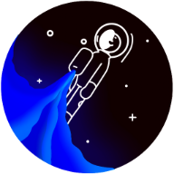

# Odyssey

Have you ever thought about revamping your lifestyle to become a healthier, happier and more mindful person, only to give up a week later?
You’re not alone: studies show that 80% of all goals that people set for themselves are abandoned within the first month!
Now, if only you had a partner that you could count on to set you up for success and propel you past this initial month that kills off the dreams of so many.

Meet Odyssey, a community-based app that encourages you to achieve more and become a better version of yourself.
On Odyssey, you can browse a range of categories that align best with your personal goal.
With challenges that are carefully sourced and curated by the team over a wide range of categories, you will find something suitable for you whether you are interested in forming healthy routines or picking up a new interest.

   

Odyssey allows you to dream big while it does the nitty gritty for you: each challenge breaks a goal down into manageable, day-to-day tasks that increment slowly in difficulty and intensity.
By providing you with concrete steps, you can be assured that they are on the right track to achieving your goal.

What really makes Odyssey complete is its community aspect.
Working towards a goal alone can lead us to feel lost and lonely, and having someone to guide us or even just to hold us accountable has been shown to increase our likelihood to follow through on what we commit to.
This is why Odyssey makes it easy for you to hop on a challenge with your friends or share your progress, struggles and achievements within your friend circle and a wider community.

Odyssey is also peppered with delightful, carefully designed details to make your in-app experience and overall journey enjoyable.
With features ranging from a statistics column for those interested in measuring their progress to maps of unique lands that you can explore with your friends and collect mementos from, working towards your goals has never been breezier.

What are you waiting for?
Start your odyssey today with [Odyssey](https://odyssey-app.com)!

## Team

| Member      | Role |
| ----------- | ----------- |
| Cai Jia Lin (A0205575A) | UI/ UX, full stack, marketing |
| Ian Yong Yew Chuang (A0135451M) | UX, full stack, deployment |
| Sebastian Toh Shi Jian (A0196545R) | UX, full stack, deployment |
| Wu Weiming (A0210627N) | UI/ UX, full stack, marketing |

## Getting Started

1. Follow the instructions in the respective frontend and backend `README`s.
